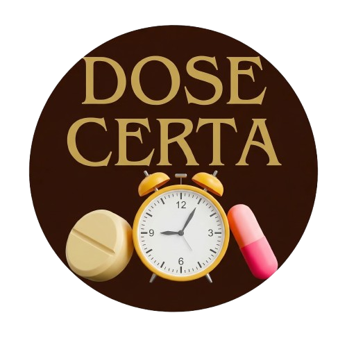

<div align="center">
  
</div>

<br/>

# 💊 Dose Certa

Dose Certa é um aplicativo móvel, desenvolvido com Flutter, criado para facilitar o gerenciamento de medicamentos e simplificar sua rotina de saúde. Intuitivo, focado em regras médicas e totalmente offline, ele é a ferramenta definitiva para acabar com o esquecimento de horários e a falta de comprimidos na cartela!

## 🎯 Objetivo

O projeto nasceu da necessidade de ter uma ferramenta privada, offline e à prova de falhas para gerenciar medicações rotineiras, visando auxiliar idosos, pacientes crônicos ou cuidadores. Com o Dose Certa, o usuário pode cadastrar tratamentos completos, programar alarmes em tela cheia que não passam despercebidos, verificar quando os seus medicamentos estão acabando e até mesmo localizar farmácias reais ao redor de sua localização. Ao final, o app gera relatórios de adesão ao tratamento para garantir que a saúde está em ordem.

## ✨ Funcionalidades Principais

-   ⏰ **Alarmes Persistentes:** Ao invés de uma notificação simples que desaparece, o app dispara um alarme contínuo, vibrando intensamente o celular para alertar sobre o horário do remédio. Ele é desenhado para chamar sua atenção até que você interaja com a notificação, confirmando ou adiando a medicação.
-   📦 **Controle de Estoque Inteligente:** Alertas automáticos que deduzem a posologia tomada e te avisam antecipadamente antes que a cartela de remédios chegue ao fim.
-   🗺️ **Radar de Farmácias:** Um mapa interativo e gratuito na aba de descobrimento que escaneia um raio prático de você, localizando agilmente farmácias e drogarias reais.
-   📊 **Relatórios de Adesão:** Avalie sua assiduidade aos seus tratamentos.
-   ✈️ **100% Offline e Privado:** Todos os seus dados, regras médicas e históricos são salvos localmente (SQLite) no seu dispositivo. Funciona em qualquer lugar e sem taxas, protegendo sua privacidade.
-   🔐 **Arquitetura Limpa e Escalável:** A aplicação não é só de fachada, possuindo uma base sólida de "Clean Architecture" com BLoC e separação rigorosa de entidades.

## 🛠️ Tecnologias e Dependências

-   **Flutter:** Framework principal para o desenvolvimento da interface e do aplicativo multiplataforma.
-   **Dart:** Linguagem de programação utilizada pelo framework.
-   **SQLite:** Banco de dados local para armazenamento das entidades e histórico temporal.

#### Principais Dependências:
-   `flutter_local_notifications`: Essencial para a construção silenciosa e os alarmes nativos superpositivos (Insistent Intent) do Android.
-   `flutter_map`: Motor de navegação para a exibição dos mapas e leitura de APIs espaciais do OpenStreetMap.
-   `flutter_bloc`: O padrão global (Manager State) que conduz a tela a partir das lógicas do banco de dados.
-   `get_it`: Localizador de serviço responsável por injetar dependências entre os blocos Clean separados.

## 🚀 Como Executar o Projeto

Se você é um desenvolvedor e quer testar o projeto, siga os passos:

1.  **Clone o repositório:**
    ```bash
    git clone https://github.com/MateusFerreiraM/dose_certa.git
    ```

2.  **Entre na pasta do projeto:**
    ```bash
    cd dose_certa
    ```

3.  **Instale as dependências:**
    ```bash
    flutter pub get
    ```

4.  **Execute o aplicativo:**
    ```bash
    flutter run
    ```

## 📄 Licença

Este projeto está sob a licença MIT.